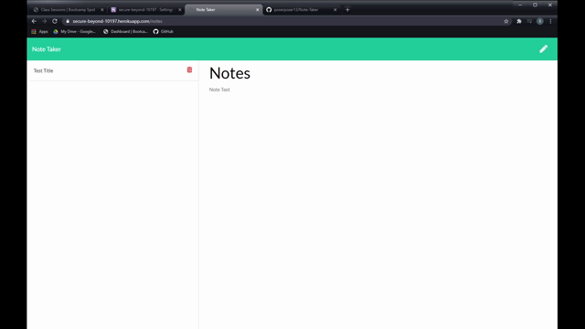

 # Note Taker
  

  ## Table of Contents

* [Installation](#installation)
* [Description](#description)
* [Usage](#usage)
* [Credits / Contributing](#contributing)
* [Tests](#tests)
* [Questions](#questions)
* [License](#license)

## Installation 
The user jsut needs to enter in the applications heroku url, and it will be able to work properly.

## Description
This application allows a user to create a note, which contains at title and a body, and lets them save it. This save doesn't save it to the local storage. Instead, it reads from a json file. When the save button is clicked on, the get route is run, which reads the file, then adds new json, and then re-writes the file. The delete route does the same thing except will find a specific id that was given to a note, then deletes that note before re-writing the file again. These routes are all created by using express.js and node.js. The javascript utilizes jquery ajax calls in order to get the correct path. 

## Usage
The user goes to the notes page and starts saving and deleting notes as they need. The notes they enter will always stay.

## Credits / Contributing
If anyone would like to provide a contribution, they just need to contact me so I can add them to the github repository.

## Tests
I tested this application through trial and error. 

## Questions
If you have any questions:
 
Contact through GitHub: poserposer13
 
Contact through email: seankempf13@gmail.com

## License 
This project is covered under the MIT license.

## Screenshots

 

